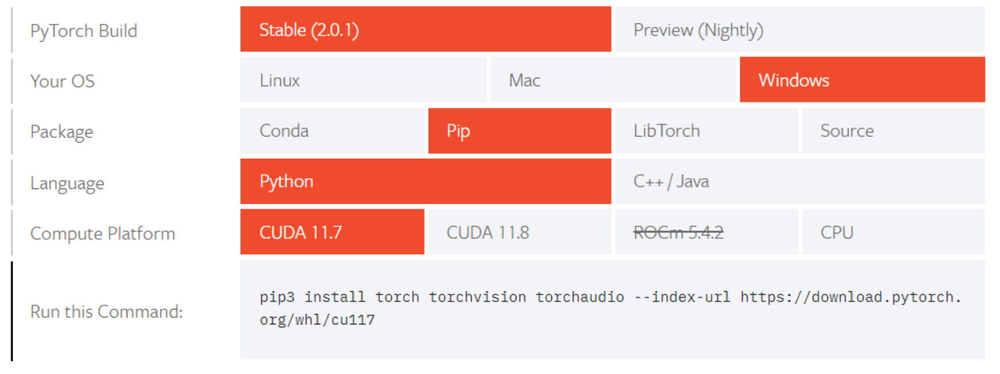

# LSTM-IMDB
大语言模型辅助软件工程课程作业 基于LSTM的影评情感分类


## 一、实践
本部分首先介绍 Pytorch 官方提供的示例程序，作为作业程序的基础。
首先需要配置环境，包括安装 python、pytorch、Pycharm。建议使用 Anaconda 管理 python 环境，保
证设备上不同 python 项目的 python 环境互不干扰，特别是不会有依赖冲突的问题。环境配置具体包括以
下几个步骤：
1. 安装 Anaconda：https://docs.anaconda.com/free/anaconda/install/index.html
2. 创建虚拟 python 环境：https://docs.anaconda.com/free/anaconda/configurations/switch-environment/
   - 创建环境命令：`conda create –name LLM4SE python=3.10` 
   - 启动刚才的 python 环境：`activate LLM4SE`
3. 在这个环境中安装 pytorch 相关的库：首先查看页面：https://pytorch.org/get-started/locally/ ，这里会
   自动检测你系统的信息，示例如下： 
4. 最后的“Run this Command”提供的是可以用来安装 Pytorch 的命令，直接拷贝下来，在刚才启动的环境中运
   行这个命令，就可以开始安装了，如下（这里我的虚拟环境名字为 LLM4SE）：
5. 安装 pycharm，一个对 python 支持非常强大的集成开发环境（IDE）：https://www.jetbrains.com/pycharm/
   安装好之后（可能需要注册、激活，好像可以用学校邮箱免费激活）打开，创建 Python 项目，在项目
   下新建 python 文件（随意命名，例如 SimpleNN.py），将官方提供的 pytorch 示例程序拷贝到该文件中
6. 请仔细阅读代码中添加的注释。这个代码基本可以当作是用 pytorch 编写神经网络模型的模板，我们只
   需要定义模型、定义数据集即可。 
7. 如果想要运行这段代码，还需要为当前的 python 项目配置 python 解释器（interpreter），具体如下图：
   （点击菜单栏 File—>选择 Settings，弹出对话框，选择左边的 Project：XXXX，点击 Project Interpreter 出现
   可选的下拉框，可能需要我们点击小齿轮，Add Local…，将通过 Anaconda 创建的 python 环境加到这里，
   然后在这个界面选择）
8. 然后就可以运行这个 py 文件了，结果如下（如果报错看看是不是模型保存目录”model”文件夹没创建）：


到此为止，我们已经能够在自己配置的环境下运行官方的示例代码了。接下来就是修改官方代码，完成
我们的作业。

## 二、作业

1. 作业描述：根据给定的 IMDB 数据集（csv 文件，未划分训练集、验证集和测试集），训练一个基于 LSTM
   的神经网络分类模型，为数据集中的每一个电影评论确定其情感极性。数据集中每一条数据是一个电影评
   论，以及这个评论的情感极性，即积极（positive）和消极（negative），如下图：
2. 过程指导：
   1. 自行划分训练集（70%）、验证集（10%）、测试集（20%）。分别统计训练集、验证集、测试集中 positive
   和 negative 数据的规模，并统计整个数据集中评论的平均长度（词语个数）、最大和最小长度，在实验报告
   中汇报。注意：训练集用来训练模型；验证集用来为模型选择超参数，例如 batch size、epoch、loss function、
   activation function、input length、optimizer 等（分别设置不同的选择，训练后在验证集上看效果，如果验
   证集达到最好的效果，则选定这些超参数）；测试集用来评估使用选定的超参数训练的模型的效果。
   2. 评价指标就使用示例代码中的 accuracy 即可。
   3. 【可选】对所有文本过滤停用词。自行选择停用词表（Stop words），将评论中的这些词删掉，形成新
   的数据集，基于新的数据集训练和评估模型。
   4. 使用 word2vec 为数据集构建词语的向量表示，将每一个评论转换为词向量的数组，和极性标签。
   Word2vec 的用法参考：https://radimrehurek.com/gensim/models/word2vec.html
   其关键是使用所有的文本构建 Word2vec 模型，然后再用模型将每一个评论变成词语的向量表示：
   
      ```python
      ## 首先需要在我们的虚拟 python 环境中安装 gensim 库，先 activate 我们创建的环境，
      ## 再使用 pip2 install gensim 安装 gensim
      from gensim.test.utils import common_texts
      from gensim.models import Word2Vec
      ## 下面这句话是构建 Word2Vec 模型，自行查看官方文档，了解每一个参数的含义
      model = Word2Vec(sentences=common_texts, vector_size=100, window=5, min_count=1, workers=4)
      ## 然后保存模型
      model.save("word2vec.model")
      ## 可以用下面的方式将词语‘computer’变成向量，可以 print(vector)试试看是什么
      vector = model.wv['computer']
      ```   
   
      可以将给大家的 csv 文件直接拷贝到 txt 文件中，当作文本文件处理，可以可以使用 pandas 库处理 csv 文件
      （ 同 样 在 我 们 的 python 环境中 用 pip3 install pandas 命 令 安 装 ）。 pandas 用法参考：
      https://pandas.pydata.org/docs/getting_started/index.html
   
      转换成向量的数据文件中，每一个评论应该是一个向量数组和一个标签（positive 或 negative）。接下来就是
      使用这个文件构建我们的数据集。
   
   5. 第一部分实践中，我们给出的示例代码用的是官方的 FashionMNIST()数据集，这里我们需要为我们的
      评论数据自定义一个数据集，包括训练、验证和测试三个子集，可以分别定义数据集对象。在 pytorch 中自
      定义数据集的方法可参考：https://pytorch.org/tutorials/beginner/basics/data_tutorial.html#creating-a-custom-dataset-for-your-files （请仔细阅读这个页面的示例文件，最好自己能够理解）
   
      这里我们简单解释一下这个例子：
   
      ```python
      import os
      import pandas as pd
      from torchvision.io import read_image
      
      #注意这里是继承了一个 Dataset 基础类，很多功能是这个基础类就有的，
      #我们只需要按照这个示例实现__init__和__getitem__就行了
      class CustomImageDataset(Dataset):
         def __init__(self, annotations_file, img_dir, transform=None, target_transform=None):
            #这里使用 pandas 读取 csv 文件，参数应该是一个文件路径，这个文件里面放的是每一张图片的类型，图片是另外存放的
            #我们的数据不同，我们是评论的向量和标签放在一起的
            self.img_labels = pd.read_csv(annotations_file)
            self.img_dir = img_dir#这里定义了图片的根目录
            self.transform = transform
            self.target_transform = target_transform
         
         def __len__(self):
             return len(self.img_labels)
      
         #这个方法是关键，需要我们根据 idx 返回每一条对应序号的数据，包括 x 和 y，这个例子中 x 是 image,y 是 label
         #我们的评论数据中，x 是转换之后的 word vector 数组，y 是极性标签
         #我们的数据集比这个示例要简单，可以直接在__init__中将所有数据以数组读出来，然后在__getitem__中用 idx 获取就行了
         def __getitem__(self, idx):
             img_path = os.path.join(self.img_dir, self.img_labels.iloc[idx, 0])
             image = read_image(img_path)
             label = self.img_labels.iloc[idx, 1]
             if self.transform:
                 image = self.transform(image)
             if self.target_transform:
                 label = self.target_transform(label)
             return image, label
      ```

      根据上述的例子，我们可以实现一个训练数据集（请仔细阅读 pandas 的 read_csv 方法的说明）：
         
      ```python
      import os
      import pandas as pd
      from torchvision.io import read_image
      class IMDBTrainingDataset(Dataset):
         def __init__(self, train_file, transform=None, target_transform=None):
             self.vectors_labels = pd.read_csv(train_file) #第一列是 vector，第二列是 label
            
         def __len__(self):
             return len(self.img_labels)
         
         def __getitem__(self, idx):
            vector = self.vectors_labels.iloc[idx, 0]
            label = self.vectors_labels.iloc[idx, 1]
            return vector, label
      ```   

   6. 定义 lstm 模型，上述示例程序用的是全连接神经网络，本次作业要求大家使用 LSTM 网络。这个可以
   直接使用 Pytorch 中已经封装好的 LSTM：https://pytorch.org/docs/stable/generated/torch.nn.LSTM.html 。
   例如，我们作业中可以这样定义网络结构（不完整，需要添加二分类的层，参考第一部分的教程）：
         
      ```python
      class MyLSTM(nn.Module):
         def __init__(self, input_size, hidden_dim):
            super(MyLSTM,self).__init__()
            self.input_dim = input_size
            self.hidden_dim = hidden_dim
            #此处 input_size 是我们 word2vec 的词向量的维度；
            #这里设置了输入的第一个维度为 batchsize，那么在后面构造输入的时候，需要保证第一个维度是 batch size 数量
            self.lstm = nn.LSTM(input_size, hidden_dim, batch_first=True)
            
         def init_hidden(self, batch_size):#初始化两个隐藏向量 h0 和 c0
            return (Variable(torch.zeros(1, batch_size, self.hidden_dim)), Variable(torch.zeros(1, batch_size, self.hidden_dim)))
               
         def forward(self, input):#不可以自己显式调用，pytorch 内部自带调用机制
            #input 是传递给 lstm 的输入，它的 shape 应该是（每一个文本的词语数量，batch size，词向量维度）
            #输入的时候需要将 input 构造成
            self.hidden = self.init_hidden(input.size(0)) #input.size(0)得到 batch_size
            lstm_out, self.hidden = self.lstm(seq, self.hidden)
            return lstm_out #查看文档，了解 lstm_out 到底是什么
      ```

      注意：使用 dataloader 导入数据的时候，需要配上 batch_size，但是这样构造的 input 的 shape 需要我们手
      动查看一下，看看是不是（batch_size, sequence_length, input_size），如果不是的话，需要调整 input 的 shape
      或者在模型定义中调整 batch_first=True 的设置，并修改 forward 函数。

3. 作业提交内容
   1. 完整的实验代码，包括 word2vec 数据构造、数据集读取、训练模型、验证模型和测试模型的代码。
   2. 实验报告：
      1. 数据集划分与统计：划分方式描述，以及上述数据集的特征统计。
      2. 实验结果：使用了哪些不同的超参数设置，哪一种超参数设置在验证集上效果最好，其最终训练 loss 和测试 loss 分别是多少，测试集上的分类 accuracy 是多少

