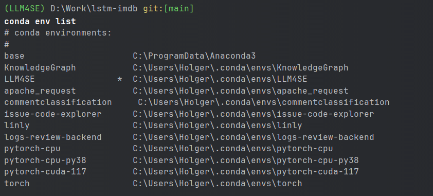
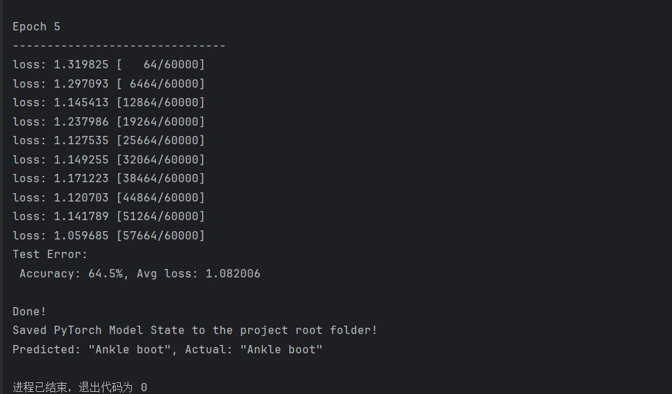
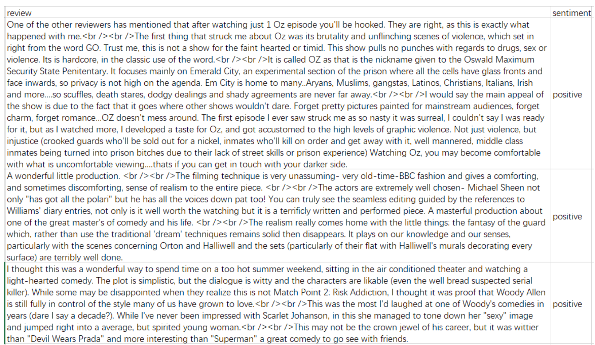

# 基于LSTM的影评情感分类

大语言模型辅助软件工程课程作业

> 522023320196 张昊

## 一、实践
本部分首先介绍 Pytorch 官方提供的示例程序，作为作业程序的基础。

首先需要配置环境，包括安装 python、pytorch、Pycharm。建议使用 Anaconda 管理 python 环境，保证设备上不同 python 项目的 python 环境互不干扰，特别是不会有依赖冲突的问题。环境配置具体包括以下几个步骤：

1. 安装 Anaconda：https://docs.anaconda.com/free/anaconda/install/index.html
2. 创建虚拟 python 环境：https://docs.anaconda.com/free/anaconda/configurations/switch-environment/
    - 创建环境命令：`conda create –name LLM4SE python=3.10`
    - 启动刚才的 python 环境：`activate LLM4SE`
3. 在这个环境中安装 pytorch 相关的库：首先查看页面：https://pytorch.org/get-started/locally/ ，这里会自动检测你系统的信息，示例如下： 
4. 最后的“Run this Command”提供的是可以用来安装 Pytorch 的命令，直接拷贝下来，在刚才启动的环境中运行这个命令，就可以开始安装了，如下（这里我的虚拟环境名字为 LLM4SE）：
   
5. 安装 pycharm，一个对 python 支持非常强大的集成开发环境（IDE）：https://www.jetbrains.com/pycharm/
   安装好之后（可能需要注册、激活，好像可以用学校邮箱免费激活）打开，创建 Python 项目，在项目下新建 python 文件（随意命名，例如 SimpleNN.py），将官方提供的 pytorch 示例程序拷贝到该文件中
   请仔细阅读代码中添加的注释。这个代码基本可以当作是用 pytorch 编写神经网络模型的模板，我们只需要定义模型、定义数据集即可。
6. 如果想要运行这段代码，还需要为当前的 python 项目配置 python 解释器（interpreter），具体如下图：（点击菜单栏 File—>选择 Settings，弹出对话框，选择左边的 Project：XXXX，点击 Project Interpreter 出现可选的下拉框，可能需要我们点击小齿轮，Add Local…，将通过 Anaconda 创建的 python 环境加到这里，然后在这个界面选择）
8. 然后就可以运行这个 py 文件了，结果如下（如果报错看看是不是模型保存目录”model”文件夹没创建）：



到此为止，我们已经能够在自己配置的环境下运行官方的示例代码了。接下来就是修改官方代码，完成我们的作业。

## 二、实验报告

**作业描述**：根据给定的 IMDB 数据集（csv 文件，未划分训练集、验证集和测试集），训练一个基于 LSTM的神经网络分类模型，为数据集中的每一个电影评论确定其情感极性。数据集中每一条数据是一个电影评论，以及这个评论的情感极性，即积极（positive）和消极（negative），如下图：


**源代码**：[main.py](main.py)

**运行结果**：


```
Positive samples: 12500, Negative samples: 12500
Average length: 171.21576, Max length: 1785, Min length: 5
Epoch 1, Loss: 0.7148992380086523
Validation Accuracy: 0.5052
Epoch 2, Loss: 0.7069131131589848
Validation Accuracy: 0.5144
Epoch 3, Loss: 0.6842232701117105
Validation Accuracy: 0.5924
Epoch 4, Loss: 0.5139895329510209
Validation Accuracy: 0.8092
Epoch 5, Loss: 0.4253690169893042
Validation Accuracy: 0.5440
Epoch 6, Loss: 0.7169930465029974
Validation Accuracy: 0.5740
Epoch 7, Loss: 0.6964793746923879
Validation Accuracy: 0.5696
Epoch 8, Loss: 0.6784039907646875
Validation Accuracy: 0.5448
Epoch 9, Loss: 0.6658051583888757
Validation Accuracy: 0.5668
Epoch 10, Loss: 0.648932651337916
Validation Accuracy: 0.6600
Test Accuracy: 0.6468
```

### 1. 数据集划分与统计

**划分方式描述**

在本实验中，我们使用IMDB数据集进行情感分类任务。数据集包含25000个正面评论和25000个负面评论。我们将数据集划分为训练集、验证集和测试集，具体划分如下：

- **训练集**：70%（35000条评论）
- **验证集**：10%（5000条评论）
- **测试集**：20%（10000条评论）

**数据集特征统计**

对数据集进行了以下统计分析：

- **正面评论**：12500条
- **负面评论**：12500条
- **评论平均长度**：171.22个词
- **评论最大长度**：1785个词
- **评论最小长度**：5个词

### 2. 实验结果

**超参数设置**

在实验中，我们使用了以下超参数设置来训练LSTM模型：

- **Word2Vec参数**：
   - `embedding_dim`：100
   - `window`：5
   - `min_count`：1
   - `workers`：8
   - `epochs`：10

- **Tokenizer参数**：
   - `length_fixed`：False
   - `sentence_max_length`：100

- **LSTM模型参数**：
   - `hidden_dim`：400
   - `output_dim`：1
   - `num_epochs`：10
   - `learning_rate`：0.01

**实验结果**

在训练过程中，我们记录了每个epoch的训练损失和验证集上的准确率。具体结果如下：

| Epoch | Train Loss | Validation Accuracy |
|-------|------------|---------------------|
| 1     | 0.7149     | 0.5052              |
| 2     | 0.7069     | 0.5144              |
| 3     | 0.6842     | 0.5924              |
| 4     | 0.5140     | 0.8092              |
| 5     | 0.4254     | 0.5440              |
| 6     | 0.7170     | 0.5740              |
| 7     | 0.6965     | 0.5696              |
| 8     | 0.6784     | 0.5448              |
| 9     | 0.6658     | 0.5668              |
| 10    | 0.6489     | 0.6600              |

从上表可以看出，第4个epoch的验证集准确率达到了最高，为80.92%。

**测试集结果**

在测试集上的分类准确率为64.68%。

**总结**

在实验中，虽然第4个epoch在验证集上表现最好，但模型在后续epoch中出现了过拟合现象，导致验证集准确率有所下降。最终模型在测试集上的准确率为64.68%，说明模型对数据集的情感分类具有一定的效果，但仍有提升空间。

### 3. 进一步改进

为了提高模型的表现，可以考虑以下几种改进方法：

1. **调整超参数**：尝试不同的学习率、隐藏层维度和epoch数量，以找到最佳的超参数组合。
2. **数据预处理**：进一步优化数据预处理步骤，如移除更多无意义词汇或使用更复杂的词嵌入方法。
3. **模型结构优化**：尝试使用更复杂的模型结构，如双向LSTM、GRU或加入Attention机制。
4. **正则化技术**：使用Dropout、L2正则化等方法防止过拟合。

通过这些改进，期望可以进一步提升模型的分类性能。